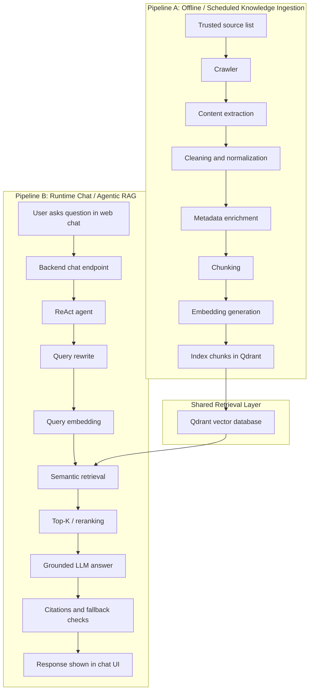
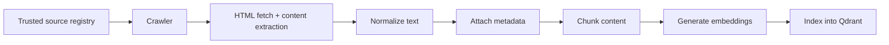
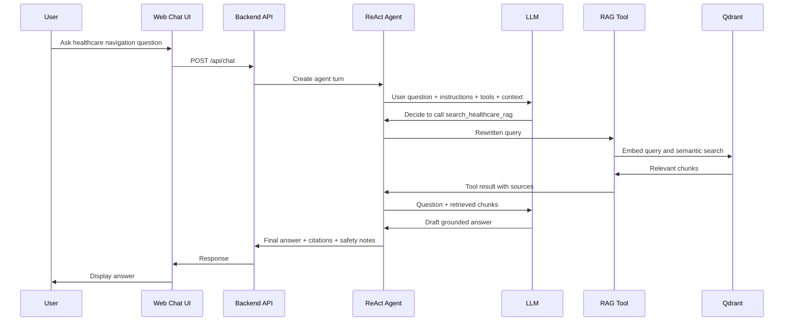
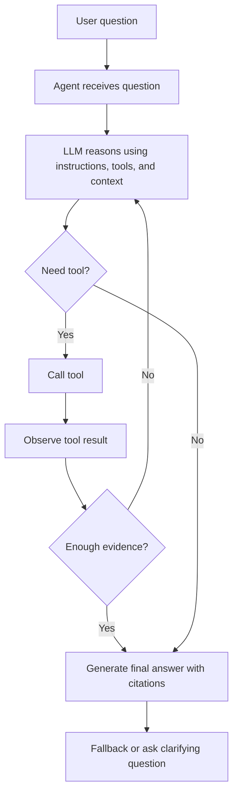

# Harbor Project Documentation

**Status:** Documentation and design only  
**Implementation state:** No code is implemented by this document  
**Product:** AI-powered Ontario healthcare navigation web application for newcomers  
**Interface:** Simple web chat UI  
**Last updated:** 2026-09-15

---

## 1. Purpose Of This Document

This document defines the planned Harbor project before implementation begins.

Harbor is planned as a web-based AI assistant that helps newcomers in Ontario understand and navigate healthcare services. It will use an agentic Retrieval-Augmented Generation architecture grounded in trusted official and public healthcare websites.

This document describes:

- Product definition and boundaries
- Core terminology and mental models
- Full planned system architecture
- Offline indexing and online chat pipelines
- Trusted-source policy
- Website crawling, extraction, metadata, chunking, embeddings, and indexing
- Query rewrite, semantic retrieval, Top-K search, and reranking
- ReAct/tool-calling loop
- Proposed tools
- LLM role and grounded answer generation
- Citations and source-backed responses
- Chat memory and user context decisions
- Safety and fallback behavior
- Frontend and backend layers
- Recommended technology stack
- Data models and metadata schema
- Conceptual API endpoints
- Refresh and incremental indexing strategy
- MVP vs later versions
- Evaluation ideas
- Repository structure proposal
- Implementation order
- Interview-ready explanation

This is not an implementation plan that claims working code exists. All system components below are planned unless explicitly marked otherwise.

---

## 2. Product Definition

### 2.1 Product Summary

Harbor is an AI-powered healthcare navigation assistant for newcomers in Ontario.

Users interact with Harbor through a simple web chat interface. They can ask questions such as:

- "How do I apply for OHIP?"
- "Can I go to a walk-in clinic before I get my health card?"
- "What should I do if I do not have a family doctor?"
- "Where can I call for non-emergency health advice in Ontario?"
- "What documents do I need for a health card?"

Harbor answers using trusted official or public healthcare sources, retrieves relevant information from a vector database, cites the sources used, and clearly communicates uncertainty when the retrieved information is insufficient.

### 2.2 Target Users

Primary users:

- Newcomers to Ontario
- International students
- Refugees and protected persons
- Temporary workers
- Permanent residents
- Recent arrivals who are unfamiliar with Ontario's healthcare system

Secondary users:

- Settlement workers
- Community health workers
- Student support staff
- Family members helping newcomers navigate healthcare access

### 2.3 Core User Need

Newcomers often struggle to understand:

- Whether they are eligible for OHIP
- How to apply for a health card
- What documents are required
- What healthcare options exist before OHIP coverage starts
- How to find a family doctor or clinic
- Where to get non-emergency advice
- Which sources are official and trustworthy

Harbor's purpose is to reduce confusion by providing plain-language, source-grounded navigation guidance.

### 2.4 Product Interface

The MVP product interface is a simple web chat UI.

The user should see:

- A chat input box
- A conversation history
- Assistant responses in plain language
- Citations or source links for factual claims
- Optional follow-up questions
- Clear safety disclaimers when appropriate

The MVP does not require:

- User accounts
- Google OAuth
- Role-based ACL
- User-uploaded document management
- Document-structure analysis tools
- Admin document editing workflows

---

## 3. Scope And Non-Scope

### 3.1 In Scope For MVP

Harbor MVP should include:

- Simple web chat UI
- Backend chat API
- Agentic RAG orchestration
- Trusted-source healthcare knowledge base
- Website crawling and content extraction for selected trusted sources
- Metadata-aware chunking
- Embedding generation
- Qdrant vector database indexing
- Semantic search over indexed healthcare chunks
- Query rewrite before retrieval
- Top-K retrieval
- Optional reranking if feasible
- LLM-generated answers grounded in retrieved chunks
- Citations for retrieved source pages
- Safety fallback when answer confidence is low
- Basic observability for queries and retrieval behavior
- Evaluation set for common Ontario healthcare questions

### 3.2 Out Of Scope For MVP

Harbor MVP should not include:

- Medical diagnosis
- Treatment recommendations
- Emergency triage beyond advising users to contact emergency services when appropriate
- Personal medical record storage
- Health card number storage
- User-uploaded medical documents
- Google OAuth
- ACL/permission systems
- Document metadata management for uploaded files
- Document-structure agent tools
- Internal enterprise document workflows
- Provider booking integration
- Insurance adjudication
- Legal immigration advice
- Replacing a healthcare professional, ServiceOntario, or government services

### 3.3 Later Possible Scope

Later versions may add:

- Multilingual support
- Guided flows for OHIP eligibility and documents
- Location-aware clinic discovery
- User preference memory
- Saved conversations
- Human handoff to settlement services
- Voice interface
- SMS or WhatsApp interface
- Admin dashboard for source freshness and retrieval quality
- Automated source monitoring
- More advanced reranking and evaluation

---

## 4. Terminology And Mental Models

This section explains the main AI concepts used in Harbor.

### 4.1 LLM

An LLM, or Large Language Model, is the language model that understands user questions and generates natural-language answers.

In the simplest chatbot:

```text
User question
    |
    v
LLM
    |
    v
Answer
```

The LLM is the "brain" that reads text and produces text.

In Harbor, the LLM should not rely only on its training memory. It should answer using retrieved healthcare source content.

### 4.2 RAG

RAG means Retrieval-Augmented Generation.

RAG gives the LLM external knowledge before it answers.

Instead of asking the LLM to answer from memory, the system first retrieves relevant source chunks from a knowledge base, then gives those chunks to the LLM as context.

```text
User question
    |
    v
Retrieve relevant source chunks
    |
    v
User question + retrieved chunks
    |
    v
LLM
    |
    v
Grounded answer with citations
```

Mental model:

- LLM = the brain
- RAG = the research material given to the brain
- Vector DB = the searchable memory of trusted source chunks

### 4.3 Embeddings

Embeddings are numerical representations of text.

They convert text into vectors so that meaning can be compared mathematically.

Example:

- "How do I apply for OHIP?"
- "Apply for an Ontario health card"
- "Get a health card in Ontario"

These phrases use different words but have similar meaning. Embeddings help the system find related content even when the exact words do not match.

### 4.4 Vector Database

A vector database stores text chunks and their embeddings.

Harbor plans to use Qdrant as the vector database.

Qdrant allows the backend to:

- Store healthcare source chunks
- Store each chunk's embedding
- Store metadata such as source URL, title, topic, and freshness
- Search for chunks semantically similar to a user question

### 4.5 Agent

An agent is a system that uses an LLM to decide what action to take next.

The agent is not a separate intelligent model. It is an orchestration system around an LLM.

The agent gives the LLM:

- System instructions
- User question
- Conversation context
- Available tools
- Retrieved tool results

The LLM then decides whether to answer or call a tool.

### 4.6 Tool Calling

Tool calling means the LLM can request that the application run a predefined function.

Example tools:

- `search_healthcare_rag(query)`
- `get_source_page(url)`
- `rewrite_query(user_question, user_context)`
- `check_answer_grounding(answer, sources)`

The LLM does not directly access Qdrant or the web. It asks the agent system to call tools. The backend executes those tools and returns results.

### 4.7 ReAct Agent

ReAct means Reason + Act.

A ReAct agent uses an iterative loop:

1. Reason about what is needed
2. Act by calling a tool
3. Observe the tool result
4. Reason again
5. Continue until ready to answer

Conceptually:

```text
User question
    |
    v
Agent gives question + tools to LLM
    |
    v
LLM decides next action
    |
    +--> Tool call
    |        |
    |        v
    |    Tool result
    |        |
    +<-------+
    |
    v
Final answer
```

For Harbor:

- The ReAct agent decides when to search the healthcare knowledge base.
- The RAG tool retrieves source chunks.
- The LLM uses those chunks to generate a cited answer.

### 4.8 Harbor Mental Model

Harbor can be understood as four layers:

```text
Web Chat UI
    |
    v
Agent Orchestration
    |
    v
RAG Tools
    |
    v
Trusted Healthcare Knowledge Base
```

Or:

```text
LLM = reasoning and answer generation
RAG = trusted external knowledge
Agent = decides when and how to use tools
Web app = product interface for users
```

---

## 5. High-Level System Architecture

Harbor has two main pipelines:

- Pipeline A: Knowledge ingestion and indexing
- Pipeline B: Runtime user chat and answer generation

Pipeline A builds the searchable knowledge base.

Pipeline B uses that knowledge base to answer user questions.

The two pipelines connect through Qdrant.



---

## 6. Pipeline A: Knowledge Ingestion And Indexing

Pipeline A prepares Harbor's trusted healthcare knowledge base.

It is offline or scheduled. It does not run for every user question.

### 6.1 Pipeline A Goals

Pipeline A should:

- Collect content only from approved trusted sources
- Extract clean text from healthcare webpages
- Preserve useful metadata
- Split pages into semantically meaningful chunks
- Create embeddings for each chunk
- Store chunks and metadata in Qdrant
- Support future refresh and incremental updates

### 6.2 Pipeline A Diagram



### 6.3 Trusted Source Registry

The source registry is a planned configuration file or database table containing approved source domains and seed URLs.

Example approved source categories:

- Ontario government health pages
- ServiceOntario health card pages
- Health811 / 811 pages
- Public Health Ontario pages
- Ontario Health pages
- Official public health unit pages
- Selected public nonprofit healthcare-navigation sources only if explicitly approved

Example official/public sources to consider:

- [Ontario.ca - Health cards, eligibility and coverage](https://www.ontario.ca/page/apply-ohip-and-get-health-card)
- [Ontario.ca - Documents needed to get a health card](https://www.ontario.ca/page/documents-needed-get-health-card)
- [ServiceOntario](https://www.ontario.ca/page/serviceontario)
- [Health811](https://health811.ontario.ca/)
- [Ontario.ca - Health care in Ontario](https://www.ontario.ca/page/health-care-ontario)
- [Ontario Health](https://www.ontariohealth.ca/)
- [Public Health Ontario](https://www.publichealthontario.ca/)

### 6.4 Website Crawling

The crawler should:

- Start from approved seed URLs
- Respect robots.txt when required
- Stay within approved domains or URL patterns
- Avoid indexing unrelated navigation, ads, footers, and repeated boilerplate
- Store crawl timestamp
- Store HTTP status
- Store canonical URL when available
- Detect content changes using hash or last-modified headers where possible

Planned crawler behavior:

```text
For each approved source:
    Fetch seed URL
    Extract links
    Keep links matching approved patterns
    Fetch allowed pages
    Extract main content
    Store raw and cleaned content metadata
```

### 6.5 Content Extraction

The extraction layer should convert webpages into clean text.

It should remove:

- Navigation menus
- Cookie banners
- Footer links
- Duplicate headers
- Unrelated scripts or styles
- Layout-only content

It should preserve:

- Page title
- Headings
- Main body text
- Lists
- Tables when meaningful
- Important links
- Publication or update dates if available
- Source URL

### 6.6 Metadata Enrichment

Each page and chunk should include metadata.

Important metadata:

- Source domain
- Source URL
- Canonical URL
- Page title
- Section heading
- Topic category
- Language
- Crawl timestamp
- Page last updated date if available
- Content hash
- Chunk index
- Trust tier
- Jurisdiction
- Effective date if available

Example topic categories:

- OHIP eligibility
- Health card application
- Required documents
- Finding a family doctor
- Walk-in clinics
- Emergency care
- Non-emergency advice
- Public health
- Mental health navigation
- Newcomer health services

### 6.7 Chunking Strategy

Chunking splits long source pages into smaller pieces for retrieval.

Good chunks should:

- Be small enough to fit into LLM context
- Be large enough to preserve meaning
- Respect headings and section boundaries
- Include metadata from the original page
- Avoid cutting important lists in half
- Support citation back to the original page

Recommended starting settings:

- Chunk size: 500 to 900 tokens
- Overlap: 80 to 150 tokens
- Split by heading first
- Split by paragraph second
- Avoid splitting tables unless necessary

Chunk example:

```json
{
  "chunk_id": "ontario_ohip_apply_0007",
  "source_url": "https://www.ontario.ca/page/apply-ohip-and-get-health-card",
  "title": "Apply for OHIP and get a health card",
  "section_heading": "Apply in person",
  "topic": "health_card_application",
  "jurisdiction": "Ontario",
  "trust_tier": "official_government",
  "text": "Cleaned source text for this section..."
}
```

### 6.8 Embedding Generation

Each chunk is converted into an embedding vector.

Embedding input should include:

- Chunk text
- Section heading
- Page title
- Possibly a short topic label

Recommended embedding text format:

```text
Title: Apply for OHIP and get a health card
Section: Apply in person
Topic: health_card_application
Content: ...
```

This gives the embedding model more context and improves retrieval quality.

### 6.9 Qdrant Indexing

Qdrant stores:

- Vector embedding
- Chunk text
- Metadata payload
- Stable chunk ID

Conceptual Qdrant collection:

```text
Collection: harbor_healthcare_chunks
Vector size: depends on embedding model
Distance metric: cosine similarity
Payload indexes:
    source_domain
    source_url
    topic
    trust_tier
    jurisdiction
    language
    last_crawled_at
```

### 6.10 Pipeline A Output

Pipeline A output is not a user-facing answer.

Its output is a searchable trusted knowledge base:

```text
Trusted websites
    |
    v
Clean chunks + metadata + embeddings
    |
    v
Qdrant collection
```

---

## 7. Pipeline B: Runtime Chat And Agentic RAG

Pipeline B runs when a user asks a question in Harbor's web chat.

### 7.1 Pipeline B Goals

Pipeline B should:

- Understand the user's question
- Rewrite vague questions into better retrieval queries
- Search Qdrant for relevant trusted chunks
- Optionally rerank retrieved chunks
- Let the ReAct agent decide whether more tool calls are needed
- Generate a grounded answer
- Include citations
- Avoid unsupported claims
- Provide safety fallback when needed

### 7.2 Pipeline B Diagram



### 7.3 User Question Examples

Example 1:

```text
User: I just moved to Toronto. How do I get health coverage?
```

Possible rewritten retrieval query:

```text
Ontario newcomer apply for OHIP health card eligibility documents
```

Example 2:

```text
User: I don't have a family doctor. What do I do?
```

Possible rewritten retrieval query:

```text
Ontario find family doctor Health Care Connect walk-in clinic non-emergency care
```

Example 3:

```text
User: Can I call someone if I am sick but it is not an emergency?
```

Possible rewritten retrieval query:

```text
Ontario non emergency health advice Health811 call 811
```

---

## 8. Query Rewrite

Query rewrite improves retrieval quality by transforming conversational user language into a search-friendly query.

### 8.1 Why Query Rewrite Is Needed

Users often ask vague or informal questions:

- "How do I get coverage?"
- "Where do I go if I feel sick?"
- "Can I get a card?"
- "I am new here. What do I do?"

The system needs to connect those questions to official healthcare terminology:

- OHIP
- Ontario health card
- ServiceOntario
- eligibility
- required documents
- Health811
- family doctor
- walk-in clinic

### 8.2 Query Rewrite Inputs

The query rewrite step may use:

- Current user question
- Recent conversation history
- Known user context if voluntarily provided
- Target jurisdiction: Ontario
- Source domain preferences

### 8.3 Query Rewrite Outputs

The output should be one or more retrieval queries.

Example:

```json
{
  "original_question": "I just landed and need a doctor. What can I do?",
  "rewritten_queries": [
    "Ontario newcomer healthcare access before OHIP family doctor walk-in clinic",
    "Ontario apply for OHIP health card newcomer eligibility",
    "Ontario non emergency medical advice Health811"
  ],
  "detected_intent": "newcomer_healthcare_access",
  "needs_safety_check": false
}
```

### 8.4 Query Rewrite Examples

| User Question | Rewritten Query |
|---|---|
| "How do I get a health card?" | "Ontario apply for OHIP get health card required documents ServiceOntario" |
| "Can I see a doctor without OHIP?" | "Ontario healthcare access without OHIP walk-in clinic newcomer uninsured care" |
| "What number do I call if it is not an emergency?" | "Ontario non-emergency health advice call 811 Health811" |
| "I need a family doctor." | "Ontario find a family doctor Health Care Connect official" |
| "What papers do I need?" | "Ontario documents needed to get a health card OHIP proof of identity residency citizenship immigration status" |

---

## 9. Semantic Retrieval, Top-K, And Reranking

### 9.1 Query Embedding

After query rewrite, the backend creates an embedding for the rewritten query.

```text
User question
    |
    v
Query rewrite
    |
    v
Embedding model
    |
    v
Query vector
```

The query vector is compared against chunk vectors stored in Qdrant.

### 9.2 Semantic Search

Qdrant returns chunks whose embeddings are close to the query embedding.

This allows Harbor to find relevant content even when the exact words differ.

Example:

```text
Query: "health coverage for newcomers in Ontario"
May retrieve chunks about:
- OHIP eligibility
- Applying for a health card
- Required documents
- ServiceOntario process
```

### 9.3 Top-K Retrieval

Top-K means retrieving the K most similar chunks.

Recommended starting values:

- Retrieve Top 20 from Qdrant
- Rerank down to Top 5 to 8 for LLM context
- Include only chunks above a minimum similarity threshold

Conceptual settings:

```json
{
  "initial_top_k": 20,
  "final_top_k": 6,
  "minimum_similarity": 0.35,
  "prefer_trust_tier": "official_government"
}
```

### 9.4 Reranking

Reranking is optional for MVP but recommended if time allows.

The first retrieval step finds semantically similar chunks. A reranker then scores which chunks best answer the specific question.

Reranking can improve quality when:

- Many chunks are similar
- The question is specific
- The source pages are long
- The user asks a multi-part question

Possible reranking approaches:

- Lightweight LLM-based reranking
- Cross-encoder reranker
- Metadata boosts for official sources
- Topic-specific boosts

### 9.5 Retrieval Output

Retrieval output should include:

- Chunk text
- Source URL
- Page title
- Section heading
- Similarity score
- Rerank score if available
- Source trust tier
- Last crawled timestamp

---

## 10. ReAct And Tool-Calling Loop

### 10.1 Why Use An Agent

A simple RAG chatbot always retrieves first, then answers.

An agentic RAG system can decide:

- Whether retrieval is needed
- What query to use
- Whether to call retrieval more than once
- Whether the retrieved results are sufficient
- Whether the answer should include a fallback
- Whether the question is outside scope

### 10.2 Planned Agent Loop



### 10.3 Proposed Tools

The following tools are planned. They are not implemented yet.

#### `rewrite_healthcare_query`

Purpose:

- Convert user wording into search-ready healthcare queries.

Input:

```json
{
  "question": "How do I get coverage?",
  "conversation_context": "...",
  "user_context": {
    "province": "Ontario"
  }
}
```

Output:

```json
{
  "queries": [
    "Ontario apply for OHIP health card eligibility newcomer"
  ],
  "intent": "ohip_application",
  "confidence": 0.82
}
```

#### `search_healthcare_rag`

Purpose:

- Search Qdrant for relevant trusted source chunks.

Input:

```json
{
  "query": "Ontario apply for OHIP health card eligibility newcomer",
  "top_k": 6,
  "filters": {
    "jurisdiction": "Ontario",
    "language": "en"
  }
}
```

Output:

```json
{
  "chunks": [
    {
      "chunk_id": "ontario_ohip_apply_0007",
      "text": "...",
      "source_url": "https://www.ontario.ca/page/apply-ohip-and-get-health-card",
      "title": "Apply for OHIP and get a health card",
      "score": 0.78
    }
  ]
}
```

#### `get_source_metadata`

Purpose:

- Retrieve metadata for a source page or chunk.

Useful for:

- Citation formatting
- Freshness checks
- Source trust display

#### `check_grounding`

Purpose:

- Check whether the draft answer is supported by retrieved sources.

This may be implemented as:

- A rule-based check for citations
- An LLM verifier
- A combination of both

#### `route_safety_or_scope`

Purpose:

- Detect when the user is asking for medical diagnosis, emergency advice, crisis support, or out-of-scope information.

Output may include:

- `safe_to_answer`
- `needs_emergency_message`
- `out_of_scope`
- `ask_clarifying_question`

### 10.4 Agent Instruction Principles

The agent should be instructed to:

- Use trusted healthcare retrieval for factual healthcare questions
- Prefer official Ontario sources
- Do not invent eligibility rules, documents, phone numbers, or procedures
- Cite sources for factual claims
- Say when information is missing or uncertain
- Avoid medical diagnosis
- Encourage emergency services for emergencies
- Use plain language for newcomers
- Ask clarifying questions only when necessary

---

## 11. LLM Role

The LLM has several planned roles in Harbor:

1. Understand user intent
2. Rewrite queries for retrieval
3. Decide which tools to call
4. Interpret retrieved source chunks
5. Generate a plain-language answer
6. Cite the sources used
7. Communicate uncertainty
8. Ask a follow-up question if needed
9. Refuse or redirect out-of-scope requests safely

The LLM should not:

- Make up healthcare policies
- Diagnose symptoms
- Replace official services
- Answer factual healthcare questions without retrieval when retrieval is required
- Hide uncertainty
- Use uncited claims for important procedural guidance

---

## 12. Grounded Generation And Citations

### 12.1 Grounded Generation

Grounded generation means the LLM generates answers using retrieved source chunks as evidence.

The answer should be based on:

- User question
- Conversation context
- Retrieved chunks
- Source metadata
- Safety instructions

### 12.2 Citation Requirements

Harbor should cite source pages for factual claims.

Citation format can be simple:

```text
Sources:
1. Ontario.ca - Apply for OHIP and get a health card
2. Ontario.ca - Documents needed to get a health card
```

Each citation should include:

- Page title
- Source organization or domain
- URL
- Optional section heading
- Optional last updated date if available

### 12.3 Answer Style

Answers should be:

- Plain language
- Calm and practical
- Short enough to be readable
- Structured with bullets or steps when helpful
- Careful about eligibility and legal status
- Clear when the user should verify with an official source

Example answer style:

```text
You can apply for an Ontario health card through ServiceOntario if you meet OHIP eligibility rules. In general, you will need documents that prove your identity, Ontario residency, and eligible status in Canada.

Good next steps:
1. Review the official OHIP eligibility page.
2. Gather the required documents.
3. Visit a ServiceOntario centre if the application must be completed in person.

Sources:
- Ontario.ca - Apply for OHIP and get a health card
- Ontario.ca - Documents needed to get a health card
```

### 12.4 Unsupported Claims Policy

If the retrieved chunks do not support the answer, Harbor should:

- Say it does not have enough trusted information
- Offer to search a more specific topic
- Suggest checking official sources directly
- Avoid guessing

---

## 13. Trusted-Source Policy

### 13.1 Source Trust Tiers

Harbor should classify sources by trust tier.

| Trust Tier | Description | Example |
|---|---|---|
| `official_government` | Government pages and official provincial services | Ontario.ca, ServiceOntario |
| `official_health_agency` | Public healthcare agencies | Ontario Health, Public Health Ontario |
| `official_public_health_unit` | Local public health units | Toronto Public Health, Peel Public Health |
| `approved_public_nonprofit` | Approved public nonprofit healthcare/navigation organizations | To be selected carefully |
| `unapproved` | Not allowed for indexing | Blogs, forums, random SEO pages |

### 13.2 Source Inclusion Rules

A source may be included if it:

- Is official or publicly accountable
- Is relevant to Ontario healthcare navigation
- Provides stable public information
- Can be cited to users
- Has acceptable crawl permissions
- Does not primarily contain user-generated content

### 13.3 Source Exclusion Rules

A source should be excluded if it:

- Is not healthcare-navigation related
- Is a private marketing page without public accountability
- Provides unverified medical advice
- Contains mostly ads or SEO content
- Is user-generated content
- Has unclear jurisdiction
- Conflicts with official Ontario sources

### 13.4 Conflict Resolution

When sources conflict:

1. Prefer the most official source.
2. Prefer the most recent source if trust tiers are equal.
3. Mention uncertainty if needed.
4. Do not merge conflicting rules into a single confident answer.
5. Direct the user to the official page for verification.

### 13.5 Freshness Policy

Healthcare access rules can change.

Harbor should track:

- Crawl date
- Source page last updated date when available
- Content hash
- Source status
- Staleness threshold

Suggested freshness thresholds:

- Critical procedural pages: refresh weekly
- General navigation pages: refresh monthly
- Low-change pages: refresh quarterly

---

## 14. Chat Memory And User Context

### 14.1 MVP Decision

For MVP, Harbor should use short-term session memory only.

This means:

- The assistant can remember recent conversation turns during the active chat.
- The system does not require user accounts.
- The system does not store long-term personal health information.

### 14.2 User Context

Harbor may use lightweight context if the user voluntarily provides it.

Examples:

- "I am in Toronto."
- "I am an international student."
- "I just arrived."
- "I do not have OHIP yet."

The system can use this context to improve answers, but should avoid storing sensitive information by default.

### 14.3 Sensitive Information Policy

Harbor should not ask for or store:

- Health card number
- Social Insurance Number
- Passport number
- Medical record details
- Detailed symptoms beyond what is necessary for safe navigation
- Financial account information

If the user provides sensitive information, the assistant should not repeat it unnecessarily and should guide the user back to general navigation.

### 14.4 Later Memory Options

Later versions may support:

- Saved user preferences
- Preferred language
- Location at city or region level
- Saved checklist progress
- Account-based history

These should require explicit consent and privacy review.

---

## 15. Safety And Fallback

### 15.1 Safety Boundaries

Harbor is a healthcare navigation assistant, not a medical provider.

It should not:

- Diagnose symptoms
- Recommend treatment
- Tell users whether they do or do not have a condition
- Replace emergency services
- Replace a doctor, nurse, pharmacist, or official government service

### 15.2 Emergency Handling

If a user describes an immediate emergency, Harbor should advise them to contact emergency services or go to an emergency department.

Example:

```text
If this is an emergency or someone may be in immediate danger, call 911 or go to the nearest emergency department.
```

### 15.3 Medical Advice Handling

If a user asks for medical diagnosis or treatment:

- Acknowledge the concern
- Explain that Harbor cannot diagnose
- Suggest contacting a healthcare professional
- Offer navigation help, such as how to find care or call non-emergency health advice

### 15.4 Low-Confidence Fallback

If retrieval quality is weak:

```text
I do not have enough reliable source information to answer that confidently. I can help you look for official Ontario healthcare information if you ask a more specific question.
```

### 15.5 Out-of-Scope Fallback

If the question is outside Ontario healthcare navigation:

```text
I am designed to help with Ontario healthcare navigation. I may not be the right tool for that question, but I can help with OHIP, health cards, finding care, Health811, and newcomer healthcare access in Ontario.
```

---

## 16. Frontend Layer

### 16.1 MVP Frontend

The frontend should be a simple web chat application.

Core UI components:

- Chat history
- User message bubble
- Assistant message bubble
- Text input
- Send button
- Loading state
- Citation display
- Error state
- Optional suggested follow-up prompts

### 16.2 Frontend Behavior

The frontend should:

- Send user messages to the backend
- Display assistant responses
- Display citations clearly
- Show when the assistant is thinking or searching
- Preserve chat history during the session
- Avoid overwhelming the user
- Use accessible design

### 16.3 Suggested Follow-Up Prompts

After answers, Harbor may show follow-up suggestions:

- "What documents do I need?"
- "Where do I apply?"
- "Can I get care before OHIP?"
- "How do I find a family doctor?"

---

## 17. Backend Layer

### 17.1 Backend Responsibilities

The backend should:

- Receive chat requests
- Manage session context
- Run the ReAct agent
- Execute tools
- Perform query rewrite
- Generate embeddings
- Query Qdrant
- Rerank results if enabled
- Call the LLM for final answer generation
- Return answer, citations, and metadata to the frontend
- Log non-sensitive telemetry for evaluation

### 17.2 Backend Services

Recommended service modules:

- Chat service
- Agent service
- Retrieval service
- Embedding service
- Source ingestion service
- Reranking service
- Citation service
- Safety service
- Evaluation service

---

## 18. Recommended Technology Stack

This stack is recommended for implementation. It is not yet implemented.

### 18.1 Frontend

Recommended:

- Next.js or React
- TypeScript
- Tailwind CSS or a simple component system
- Markdown rendering for assistant responses

### 18.2 Backend

Recommended:

- Python with FastAPI
- Pydantic for schemas
- LangGraph or a lightweight custom ReAct loop
- OpenAI or compatible LLM API
- OpenAI or compatible embedding API

Alternative:

- Node.js backend with TypeScript if the project prefers one-language full stack

### 18.3 Vector Database

Recommended:

- Qdrant

Reasons:

- Strong vector search support
- Metadata payload filters
- Local Docker development
- Cloud deployment option
- Good fit for RAG systems

### 18.4 Crawling And Extraction

Recommended:

- httpx or requests for fetching
- BeautifulSoup, trafilatura, or readability-lxml for extraction
- Custom allowlist-based crawler
- Hash-based change detection

### 18.5 Evaluation

Recommended:

- Small hand-written golden question set
- Retrieval precision checks
- Citation coverage checks
- LLM-as-judge only as a secondary signal
- Manual review for safety-sensitive answers

---

## 19. Data Models And Metadata Schema

### 19.1 Source Registry Model

```json
{
  "source_id": "ontario_ohip",
  "name": "Ontario.ca OHIP",
  "base_url": "https://www.ontario.ca/",
  "seed_urls": [
    "https://www.ontario.ca/page/apply-ohip-and-get-health-card",
    "https://www.ontario.ca/page/documents-needed-get-health-card"
  ],
  "allowed_url_patterns": [
    "https://www.ontario.ca/page/*health*",
    "https://www.ontario.ca/page/*ohip*"
  ],
  "trust_tier": "official_government",
  "jurisdiction": "Ontario",
  "language": "en",
  "enabled": true
}
```

### 19.2 Page Model

```json
{
  "page_id": "page_abc123",
  "source_id": "ontario_ohip",
  "url": "https://www.ontario.ca/page/apply-ohip-and-get-health-card",
  "canonical_url": "https://www.ontario.ca/page/apply-ohip-and-get-health-card",
  "title": "Apply for OHIP and get a health card",
  "raw_html_hash": "sha256:...",
  "clean_text_hash": "sha256:...",
  "last_crawled_at": "2026-09-15T00:00:00Z",
  "source_last_updated_at": null,
  "http_status": 200,
  "language": "en",
  "trust_tier": "official_government"
}
```

### 19.3 Chunk Model

```json
{
  "chunk_id": "chunk_abc123_0004",
  "page_id": "page_abc123",
  "source_id": "ontario_ohip",
  "source_url": "https://www.ontario.ca/page/apply-ohip-and-get-health-card",
  "title": "Apply for OHIP and get a health card",
  "section_heading": "How to apply",
  "topic": "health_card_application",
  "jurisdiction": "Ontario",
  "language": "en",
  "trust_tier": "official_government",
  "chunk_index": 4,
  "text": "Cleaned chunk text...",
  "token_count": 734,
  "content_hash": "sha256:...",
  "last_crawled_at": "2026-09-15T00:00:00Z"
}
```

### 19.4 Chat Message Model

```json
{
  "message_id": "msg_123",
  "session_id": "session_456",
  "role": "user",
  "content": "How do I apply for OHIP?",
  "created_at": "2026-09-15T00:00:00Z"
}
```

### 19.5 Assistant Response Model

```json
{
  "message_id": "msg_789",
  "session_id": "session_456",
  "role": "assistant",
  "content": "You can apply for OHIP...",
  "citations": [
    {
      "title": "Apply for OHIP and get a health card",
      "url": "https://www.ontario.ca/page/apply-ohip-and-get-health-card",
      "source_id": "ontario_ohip",
      "section_heading": "How to apply"
    }
  ],
  "retrieval_metadata": {
    "queries": [
      "Ontario apply for OHIP health card"
    ],
    "chunk_ids": [
      "chunk_abc123_0004"
    ]
  },
  "created_at": "2026-09-15T00:00:00Z"
}
```

---

## 20. Conceptual API Endpoints

These endpoints are conceptual. They are planned design only.

### 20.1 Chat Endpoint

```http
POST /api/chat
```

Request:

```json
{
  "session_id": "session_456",
  "message": "How do I apply for OHIP?",
  "user_context": {
    "province": "Ontario"
  }
}
```

Response:

```json
{
  "answer": "You can apply for OHIP...",
  "citations": [
    {
      "title": "Apply for OHIP and get a health card",
      "url": "https://www.ontario.ca/page/apply-ohip-and-get-health-card"
    }
  ],
  "suggested_followups": [
    "What documents do I need?",
    "Where do I apply?"
  ]
}
```

### 20.2 Retrieval Endpoint

Internal endpoint or service method:

```http
POST /internal/retrieve
```

Request:

```json
{
  "query": "Ontario apply for OHIP health card",
  "top_k": 6,
  "filters": {
    "jurisdiction": "Ontario",
    "language": "en"
  }
}
```

### 20.3 Ingestion Endpoints

Admin/internal only:

```http
POST /internal/ingest/run
POST /internal/ingest/source/{source_id}
GET /internal/ingest/status
```

These should not be public user-facing endpoints.

---

## 21. Refresh And Incremental Indexing Strategy

### 21.1 Why Refresh Matters

Healthcare rules and public pages can change.

Harbor should avoid relying on stale content.

### 21.2 Full Reindex

A full reindex:

- Recrawls all approved sources
- Re-extracts content
- Rechunks pages
- Regenerates embeddings
- Replaces or versions Qdrant entries

Useful when:

- Chunking strategy changes
- Embedding model changes
- Source registry changes significantly

### 21.3 Incremental Indexing

Incremental indexing:

- Checks whether pages changed
- Reprocesses only changed pages
- Deletes chunks for removed pages
- Updates only affected embeddings

Change detection methods:

- HTTP ETag
- Last-Modified header
- Source visible updated date
- HTML hash
- Clean text hash

### 21.4 Versioning

Each chunk should include:

- `content_hash`
- `embedding_model`
- `chunking_version`
- `indexed_at`

This allows the system to know when old chunks must be regenerated.

---

## 22. MVP vs Later Versions

### 22.1 MVP

MVP should prove the main product loop:

```text
User asks Ontario healthcare question
    |
    v
Agent retrieves trusted source chunks
    |
    v
LLM produces cited plain-language answer
```

MVP features:

- Simple chat UI
- FastAPI backend
- Qdrant vector database
- Curated trusted source registry
- Manual or scheduled ingestion
- Query rewrite
- Semantic retrieval
- Grounded answer generation
- Citations
- Basic safety fallbacks
- Small evaluation dataset

### 22.2 Version 2

Possible V2 features:

- Multilingual answers
- Better source freshness dashboard
- Reranking
- Guided OHIP application checklist
- City-level context
- Public health unit routing
- Follow-up question generation
- More extensive evaluation suite

### 22.3 Version 3

Possible V3 features:

- Account-based saved preferences
- Human handoff
- Voice interface
- SMS or WhatsApp channel
- Admin review workflow for sources
- Automated source-drift alerts
- Fine-grained analytics

---

## 23. Evaluation Ideas

### 23.1 Evaluation Goals

Harbor should be evaluated on:

- Retrieval quality
- Answer correctness
- Citation quality
- Safety behavior
- Plain-language usefulness
- Refusal/fallback behavior
- Source freshness

### 23.2 Golden Question Set

Create a set of common questions:

- "How do I apply for OHIP?"
- "What documents do I need for a health card?"
- "Can I use OHIP right after arriving?"
- "How do I find a family doctor?"
- "What is Health811?"
- "Where do I go in an emergency?"
- "Can Harbor tell me what medicine to take?"

For each question, store:

- Expected source pages
- Required answer points
- Unsafe claims to avoid
- Ideal citation URLs

### 23.3 Retrieval Metrics

Possible metrics:

- Recall@K: whether expected source appears in top K
- Precision@K: whether retrieved chunks are relevant
- MRR: whether best source appears near the top
- Source trust ratio: percentage of cited sources from approved tiers

### 23.4 Answer Metrics

Possible metrics:

- Citation coverage
- Faithfulness to retrieved chunks
- Helpfulness
- Plain-language clarity
- No unsupported procedural claims
- Safety correctness

### 23.5 Manual Review

Manual review is important because healthcare navigation is sensitive.

Reviewers should check:

- Did the answer rely on official sources?
- Did it overstate eligibility?
- Did it avoid diagnosis?
- Did it give practical next steps?
- Were citations useful?

---

## 24. Proposed Repository Structure

This is a planned structure only.

```text
harbor/
  README.md
  docs/
    harbor_project_documentation.md
    architecture.md
    trusted_sources.md
    evaluation_plan.md
  frontend/
    src/
      app/
      components/
      styles/
  backend/
    app/
      main.py
      api/
        chat.py
      agent/
        react_agent.py
        prompts.py
        tools.py
      retrieval/
        embeddings.py
        qdrant_client.py
        rerank.py
      ingestion/
        crawler.py
        extractor.py
        chunker.py
        indexer.py
      safety/
        policy.py
      schemas/
        chat.py
        sources.py
        chunks.py
      evaluation/
        golden_questions.json
        run_eval.py
  infra/
    docker-compose.yml
    qdrant/
  tests/
    backend/
    retrieval/
    ingestion/
```

---

## 25. Recommended Implementation Order

### Phase 1: Foundation

1. Create repository structure
2. Set up backend service
3. Set up frontend chat UI
4. Set up Qdrant locally
5. Define schemas

### Phase 2: Ingestion Pipeline

1. Create trusted source registry
2. Build crawler for approved seed URLs
3. Extract and clean content
4. Add metadata
5. Chunk content
6. Generate embeddings
7. Index chunks into Qdrant

### Phase 3: Retrieval Pipeline

1. Implement query rewrite
2. Generate query embeddings
3. Search Qdrant
4. Return Top-K chunks with metadata
5. Add optional reranking

### Phase 4: Agentic Chat

1. Implement ReAct agent loop
2. Add `search_healthcare_rag` tool
3. Add safety and scope routing
4. Generate grounded answers
5. Add citations
6. Return response to frontend

### Phase 5: Evaluation And Polish

1. Create golden question set
2. Evaluate retrieval quality
3. Evaluate answer grounding
4. Improve prompts and chunking
5. Add better error handling
6. Polish frontend UX

---

## 26. Interview-Ready Explanation

Harbor is an AI-powered Ontario healthcare navigation assistant for newcomers. The product interface is a simple web chat UI where users can ask questions about OHIP, health cards, finding care, Health811, and other healthcare navigation topics.

The important architectural decision is that Harbor should not rely on the LLM's memory alone. It uses an agentic RAG architecture. First, trusted official and public healthcare websites are crawled, cleaned, chunked, embedded, and indexed into Qdrant. That is Pipeline A, the offline knowledge ingestion pipeline.

When a user asks a question, Pipeline B runs. The backend sends the question to a ReAct agent. The agent uses an LLM as its reasoning engine. The LLM can decide to call tools, especially a healthcare RAG search tool. The system rewrites the user's question into a better retrieval query, embeds that query, searches Qdrant, retrieves relevant source chunks, optionally reranks them, and gives the evidence back to the LLM. The LLM then generates a plain-language answer grounded in those chunks and includes citations.

The mental model is:

```text
LLM = the reasoning and language brain
RAG = gives the LLM trusted source material
Qdrant = stores searchable healthcare knowledge chunks
Agent = lets the LLM decide when to use tools and how to proceed
Web chat = the user-facing product
```

The system is designed around safety and trust. It should prefer official Ontario sources, cite its answers, avoid unsupported claims, and fall back when it does not have enough reliable information. It is not a medical diagnosis tool. It is a navigation assistant that helps users understand where to look, what steps to take, and which official sources support the answer.

---

## 27. Explicitly Removed Internal-Document Components

The following components are intentionally not part of Harbor's MVP design:

- Google OAuth
- Access control lists
- User-uploaded document metadata tools
- Document-structure agent tools
- Internal document parsing workflows
- Enterprise document search permissions
- Document editing or commenting systems

These components are unrelated to the intended product interface, which is a simple public-facing web chat assistant for Ontario healthcare navigation.

---

## 28. Final Summary

Harbor is planned as a trustworthy, source-grounded healthcare navigation assistant for newcomers in Ontario.

The system has two connected pipelines:

- Pipeline A builds the healthcare knowledge base from trusted sources and stores it in Qdrant.
- Pipeline B uses a ReAct agent and RAG tools to answer user questions through a simple web chat UI.

All implementation details in this document are planned components. No code has been implemented as part of this documentation artifact.

